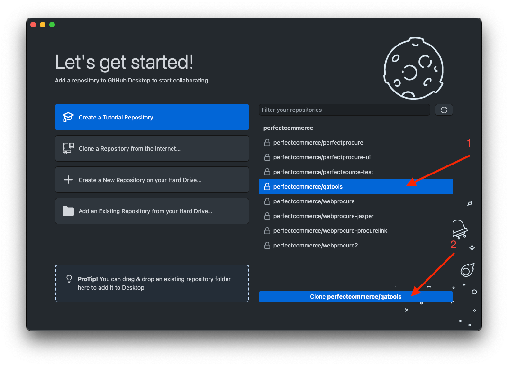
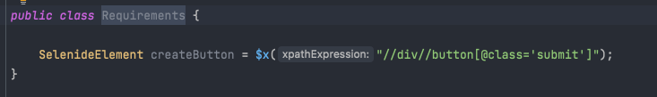

# This is a short guide how to run project and execute tests

## JDK Setup

https://adoptopenjdk.net/installation.html – just select OpenJDK 11 LTS,  Platform – your OS (most probably it will be x64 build)


## IDEA Setup

Just visit https://www.jetbrains.com/idea/download/ and download CE version that is free to use


## Install maven

* Maven is a build tool that is used to build Java applications
* It’s good to check that everything is ok on your machine before committing changes
* By this guide https://www.baeldung.com/install-maven-on-windows-linux-mac it’s possible to install maven with few steps (jdk should be installed and configured before)

## Clone a code
* Use Github Desktop - https://desktop.github.com/
* Login into application with your GH account and authorize application

  

## Import project in IntelliJ Idea

* Now it’s time to import project in Idea IDE subfolder `wp-automation`
* Select Maven & Java in import wizard
* Wait some time to import finish
* Maven need some time to download dependencies, IDEA will create a cache, etc.

  

After project is imported, go to `File -> Project Structure` amd make sure that Java SDK 11 is set as default for this project

 

## Executing sample test

Open an [LoginTest.java][1] and try to execute `loginAsBuyer` test via right-click.


[1]: src/test/java/com/perfect/tests/buyer/login/LoginTest.java

In case if everything is well-configured, output will be next:


# Selenide quick-start
## Creating simple Page-Object class

* Create a package in pages package that is related to your entity (`requirements` as example)
* Create class that is related to your entity (`Requirements.java` as example)
* Create some `SelenideElement` with xpath selector
* Basically, `SelenideElement` the implementation of some element on web-application that we can manipulate with, click, get text, check conditions etc.
* More information about Selenide can be found at official documentation - https://selenide.org/documentation.html



* Create some method that interact with your element


* Use the power of IDE to interact with elements 🙂


* Create test class that is related to your entity (`RequirementsTest.java` as example)
* Do not forget to extend from `BaseTest.java` !!!
* Annotate your test method with `@Test` annotation to make TestNG execute it during code execution


## Some general guidelines
* Page object classes should be created in main package
* It’s nice to have separate packages for every entity
* Test classes should be created in test package
* It’s nice to have separate packages for every king of test classes
* On every page-object method, use return type of this class to make possible method chaining, but basically it looks like:


* Chaining in tests, looks pretty understandable and clear:


* With every page-object method use annotation `@Step`, it will add more details to allure report

## Allure reporting and local execution via maven
* When test are executed on Jenkins, Allure report will be available on Jenkins
* When test are executed locally via `mvn clean test -Denv=qa -DsuiteXmlFile=acceptance.xml`, test report can be build with command `mvn allure:serve`

## Project configuration

* Project configuration is located in [Cfg.java][2] class
* All the properties hardcoded in this file and in [config.properties][3] that contains all values for qa, stage and prod env
* Useful changes for local test development are:
1. Change `"true"` to `"false"` to see browser window on your machine
```java
@DefaultValue("true")
boolean headless();
```
2. Sometimes it can be helpful to hold browser open after test execution to see some error on page, in this case change `"true"` to `"false"` in next property
```java
@DefaultValue("false")
boolean holdBrowserOpen();
```

PLEASE DO NOT COMMIT CHANGES IN [Cfg.java][2] class to your PR

[2]: src/main/java/com/perfect/config/Cfg.java
[3]: src/main/resources/config.properties